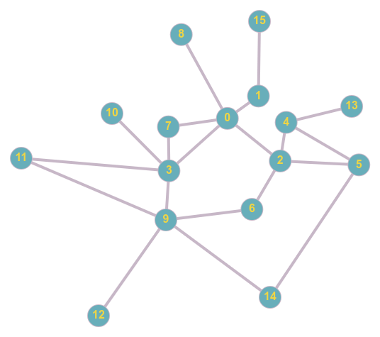

# Práctica 8 - Ejercicio para trabajar el uso de grafos

Juan es el encargado de Salud en la Universidad y está planeando el regreso a clases presenciales, el tema es que tenemos que tener mucho cuidado con los contagios. Por lo  mismo Juan te pide que crees un programa para identificar cuáles personas son las que tienen que ponerse en cuarentena cuando alguien salga positivo.

Afortunadamente tienes una base de datos con los alumnos de la universidad y con las personas que tuvieron contacto la semana pasada. Junto con una lista de las personas que salieron positivas.

Procesa los datos y muestra una lista de las personas que estuvieron en contacto directo con los que salieron positivos.

## Entrada
La entrada es un grafo.

La primera linea tiene 3 enteros separados por un espacio, **N** el número de personas (nodos) y **E** el número de conexiones entre 2 personas (aristas) y **Z**, el número positivos. Todas las personas se identifican desde **0** hasta **N-1**

Después hay **E** lineas, una por cada arista, en cada linea hay 2 enteros separados por espacio representando los nodos que se conectan entre si en esa arista. Estas son 2 personas que tuvieron contacto directo.

Luego hay **Z** números separados por espacio, las personas que se detectaron como positivas.

## Salida
Imprime la lista de nodos (personas) que tuvieron contacto directo con una persona positiva y tienen que entrar en cuarentena. 

## Ejemplo


### Entrada
```
16 20 3
0 1
0 2
0 3
0 7
0 8
1 15
2 4
2 5
2 6
3 7
3 9
3 10
3 11
4 13
4 5
5 14
6 9
9 11
9 14
9 12
5 6 15
```
### Salida

```
4 2 14 9 1
```

