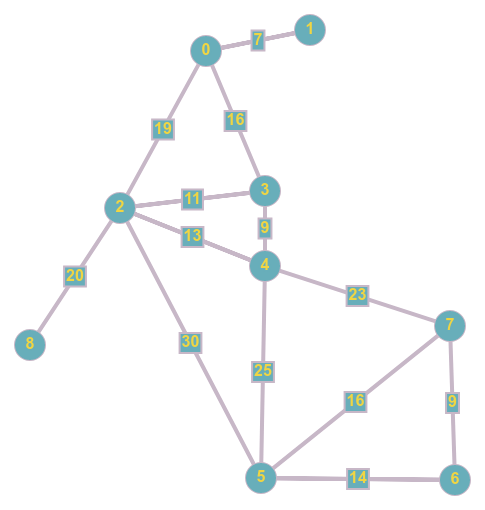

# Práctica 8 - Otro grafo pero pesado

Este fin de semana los alumnos de la Facultad de Sistemas tuvieron un Rally en un evento especial. Tenían que ir a diferentes estaciones y hacer algún ejercicio para obtener puntos. El problema es que tienen un tiempo límite y quieren saber cuánto tiempo les puede llegar a tomar hacer el recorrido hasta la estación que les falta.

Por suerte desarrollaste un programa que hace específicamente eso.

Dados los nodos y aristas (con peso) de un grafo, el nodo inicial y el nodo destino. Imprimir un camino y el tiempo que les va a tomar llegar. Este camino no tiene que ser el más óptimo.

### Input

La entrada será recibida por **STDIN**

La primera tiene 4 enteros separados por un espacio, el número de estaciones **N**, el número de caminos **E** que conecta las estaciones, la estación inicial **a** y la estación destino **b**.

Después hay **E** lineas correspondientes a cada camino, estas lineas tienen 3 enteros separados por un espacio **x**, **y**, **Z**, el numero que identifica a las 2 estaciones que conecta el puente y la cantidad de segundos que se tarda en llegar de una a la otra.

### Output

Imprime a salida estandar **STDOUT** las estaciones que tienen que recorrer y el total de segundos.

### Ejemplos



#### Entrada
```
9 13 3 6
0 1 7
0 2 19
0 3 16
2 3 11
2 8 20
2 4 13
2 5 30
3 4 9
4 5 25
4 7 23
5 7 16
5 6 14
7 6 9
```
#### Salida

```
3 4 5 6 Total:48
```

### Detalles
Pueden haber varias respuestas correctas, usen BFS o DFS.