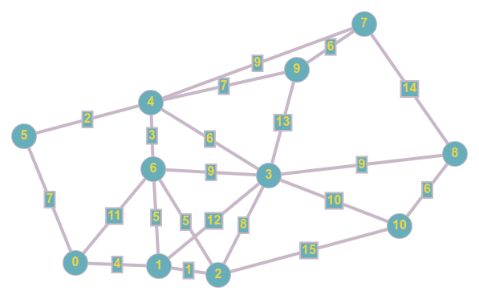

# Práctica 9 - Camino más corto para llegar temprano

A Juanito siempre se le dificulta despertarse temprano, y dependiendo de la hora a la que se despierta hay tráfico por algunas rutas camino a su trabajo. Ayúdalo haciendo un programa que tome las calles con el nivel de trafico de cada una y muestre la ruta que debe de tomar para llegar lo más pronto posible a su oficina.

### Input

La entrada será recibida por **STDIN**

La primera tiene 4 enteros separados por un espacio, el número de nodos **N**, el número de calles **E** que conecta cada nodo, el nodo inicial **a**(la casa de Juanito) y el nodo que representa la oficina **b**.

Después hay **E** lineas correspondientes a cada calle, estas lineas tienen 3 enteros separados por un espacio **x**, **y**, **Z**, el numero que identifica a los 2 nodos que conecta la calle y la cantidad de tráfico donde entre más grande el número peor está el tráfico.

### Output

Imprime a salida estandar **STDOUT** los nodos que tiene que recorrer.

### Ejemplos



#### Entrada
```
11 21 5 10
0 1 4
0 5 7
0 6 11
1 2 1
1 3 12
1 6 5
2 3 8
2 6 5
2 10 15
3 4 6
3 6 9
3 8 9
3 9 13
3 10 10
4 5 2
4 6 3
4 7 9
4 9 7
7 8 14
7 9 6
8 10 6
```
#### Salida

```
5 4 3 10
```

### Detalles
Utiliza Dijkstra para calcular el camino más corto.