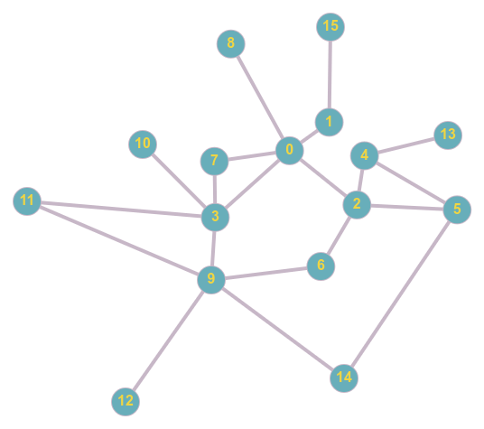

# Práctica8 - Ejercicio para trabajar el uso de grafos

## El camino más corto a su corazón
María quiere conocer a Juan, su amor platónico desde que entró a la facultad de Sistemas. Pero para hablar con él quiere que alguien que ya lo conozca los presente.

Con toda la información de quién conoce a quién representada en un grafo ayuda a María a mostrarle el camino más corto de personas con las que tiene que hablar para que conozca a Juan.

### Entrada
La entrada es un grafo.

La primera linea tiene 3 enteros separados por un espacio, **N** el número de personas (nodos) y **E** el número de conexiones entre 2 personas (aristas) y **Z**, el número identificador de Juan, nuestro destino <3. María es representada siempre como el nodo **0**.

Después hay **E** lineas, una por cada arista, en cada linea hay 2 enteros separados por espacio representando los nodos que se conectan entre si en esa arista.

### Salida
Imprime la lista de nodos que tiene que seguir María para llegar hasta el nodo **Z** de la forma más eficiente. 

### Ejemplo


#### Entrada
```
16 20 13
0 1
0 2
0 3
0 7
0 8
1 15
2 4
2 5
2 6
3 7
3 9
3 10
3 11
4 13
4 5
5 14
6 9
9 11
9 14
9 12
```
#### Salida

```
0 2 4 13
```

### Tips
Usa BFS para recorrer el grafo y con él generar la lista de nodos que forman el camino más corto.

Puede haber varios caminos de la misma longitud, en ese caso cualquiera es válido.
